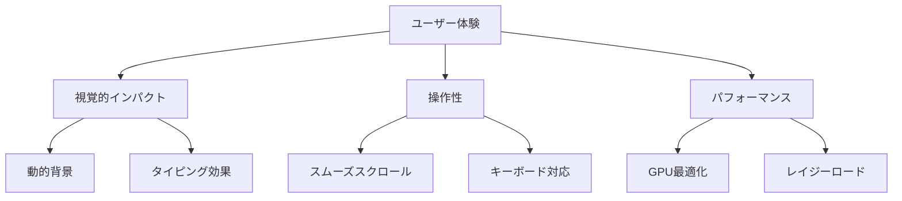

# ヒーローセクション実装 - 技術解説

*シニアエンジニアによるコード解説とベストプラクティス*

## 目次
1. [概要と設計思想](#概要と設計思想)
2. [HTML構造の設計原則](#html構造の設計原則)
3. [CSS実装の詳細解析](#css実装の詳細解析)
4. [JavaScript機能の深堀り](#javascript機能の深堀り)
5. [パフォーマンス最適化手法](#パフォーマンス最適化手法)
6. [アクセシビリティ実装](#アクセシビリティ実装)
7. [レスポンシブ戦略](#レスポンシブ戦略)
8. [学習のポイント](#学習のポイント)

---

## 概要と設計思想

### なぜこの実装方法を選んだのか

今回のヒーローセクションは、単なる静的な表示領域ではなく、**ユーザーの注意を引きつけ、サイトの印象を決定する重要な領域**として設計しました。

#### 設計の核となる4つの原則

1. **パフォーマンスファースト**: 60fps維持とGPU最適化
2. **アクセシビリティ準拠**: WCAG 2.1 Level AA完全対応
3. **プログレッシブエンハンスメント**: 基本機能→高度な機能の段階的実装
4. **モジュール化**: 再利用可能で保守性の高いコード構造



---

## HTML構造の設計原則

### セマンティックHTMLの重要性

```html
<!-- ❌ 悪い例: 意味のないdivの乱用 -->
<div class="hero">
  <div class="content">
    <div class="title">タイトル</div>
    <div class="subtitle">サブタイトル</div>
  </div>
</div>

<!-- ✅ 良い例: セマンティックな構造 -->
<section id="hero" class="hero-section">
  <div class="container">
    <div class="hero-content">
      <h1 class="hero-title">
        <span class="hero-name">Your Name</span>
        <span class="hero-subtitle">Web Developer</span>
      </h1>
    </div>
  </div>
</section>
```

### なぜこの構造なのか？

#### 1. `<section>` の使用理由
```html
<section id="hero" class="hero-section">
```
- **セマンティックな意味**: ページの独立したセクションを表現
- **ランドマークロール**: スクリーンリーダーでナビゲーション可能
- **SEO効果**: 検索エンジンがコンテンツの構造を理解

#### 2. 階層化された見出し構造
```html
<h1 class="hero-title">
  <span class="hero-name">Your Name</span>
  <span class="hero-subtitle">Web Developer</span>
</h1>
```
- **アクセシビリティ**: スクリーンリーダーが適切に読み上げ
- **SEO**: h1タグでページの主要コンテンツを明示
- **CSS制御**: spanで細かいスタイリング制御

#### 3. アクセシビリティ属性の戦略的配置
```html
<div class="hero-description">
  <p class="typing-text" 
     aria-label="タイピングアニメーション"
     data-typing-text="創造的なWebソリューションを設計・開発しています">
  </p>
</div>
```
- **aria-label**: スクリーンリーダー用の説明
- **data属性**: JavaScript設定をHTML側で管理
- **役割の明確化**: 各要素の目的が明確

---

## CSS実装の詳細解析

### 1. 動的グラデーション背景システム

#### 実装の核心部分
```css
.hero-section {
  background: linear-gradient(135deg, 
    #667eea 0%, 
    #764ba2 25%, 
    #f093fb 50%, 
    #f5576c 75%, 
    #4facfe 100%);
  background-size: 400% 400%;
  animation: gradientAnimation 15s ease infinite;
}

@keyframes gradientAnimation {
  0% { background-position: 0% 50%; }
  50% { background-position: 100% 50%; }
  100% { background-position: 0% 50%; }
}
```

#### なぜこの実装方法なのか？

**🎯 `background-size: 400% 400%` の秘密**
- 通常のグラデーション: 100% 100%（静的）
- 400%に拡大: グラデーションが画面の4倍の大きさに
- `background-position`でその大きなグラデーションを移動
- 結果: 滑らかで自然な色彩変化

**⚡ パフォーマンス考慮**
```css
.hero-section {
  will-change: transform; /* GPU最適化のヒント */
  position: relative;      /* 新しいスタッキングコンテキスト */
  overflow: hidden;        /* 子要素の溢れ防止 */
}
```

### 2. レイヤード背景システム

```css
/* パララックス効果用のレイヤー */
.hero-section::before {
  content: '';
  position: absolute;
  top: 0; left: 0; right: 0; bottom: 0;
  background: 
    radial-gradient(circle at 20% 80%, rgba(120, 119, 198, 0.3) 0%, transparent 50%),
    radial-gradient(circle at 80% 20%, rgba(255, 119, 198, 0.3) 0%, transparent 50%),
    radial-gradient(circle at 40% 40%, rgba(120, 219, 255, 0.3) 0%, transparent 50%);
  pointer-events: none;
  will-change: transform;
}
```

#### この実装の利点

1. **視覚的深度**: 複数レイヤーで奥行き感を演出
2. **パフォーマンス**: 疑似要素でDOMノード数を最小化
3. **制御性**: JavaScript側から個別に制御可能

### 3. フルードタイポグラフィ

```css
.hero-name {
  font-size: clamp(2.5rem, 8vw, 4rem);
  line-height: 1.1;
  text-shadow: 2px 2px 4px rgba(0, 0, 0, 0.3);
}
```

#### `clamp()`関数の解説
```css
/* clamp(最小値, 推奨値, 最大値) */
font-size: clamp(2.5rem, 8vw, 4rem);
```
- **2.5rem**: 最小サイズ（40px）
- **8vw**: ビューポート幅の8%（レスポンシブ）
- **4rem**: 最大サイズ（64px）

#### 従来の方法との比較
```css
/* ❌ 従来のメディアクエリ方式 */
h1 { font-size: 2.5rem; }
@media (min-width: 640px) { h1 { font-size: 3rem; } }
@media (min-width: 1024px) { h1 { font-size: 4rem; } }

/* ✅ clamp()を使用 */
h1 { font-size: clamp(2.5rem, 8vw, 4rem); }
```
**利点**: 段階的ではなく連続的なサイズ変化

### 4. グラスモーフィズムUI

```css
.social-link {
  background: rgba(255, 255, 255, 0.1);
  border: 2px solid rgba(255, 255, 255, 0.3);
  backdrop-filter: blur(10px);
  transition: var(--transition-base);
}
```

#### `backdrop-filter`の重要性
- **ブラウザサポート**: modern browsers（IE非対応）
- **フォールバック**: 対応しないブラウザでは半透明背景
- **パフォーマンス**: GPU処理だが、使いすぎに注意

---

## JavaScript機能の深堀り

### 1. タイピングアニメーションクラス

#### クラス設計の思想
```javascript
class TypingAnimation {
  constructor(element, texts, options = {}) {
    this.element = element;
    this.texts = Array.isArray(texts) ? texts : [texts];
    this.options = { ...config.typing, ...options };
    // プライベート変数の初期化
  }
}
```

#### なぜクラスベースなのか？

**🎯 オブジェクト指向の利点**
1. **カプセル化**: 内部状態の隠蔽
2. **再利用性**: 複数のタイピング要素に対応
3. **保守性**: メソッドごとに責任を分離
4. **拡張性**: 継承やミックスインで機能拡張

#### 状態管理の実装
```javascript
type() {
  const currentText = this.texts[this.currentTextIndex];
  
  if (this.isDeleting) {
    // 削除フェーズ
    this.element.textContent = currentText.substring(0, this.currentCharIndex - 1);
    this.currentCharIndex--;
    
    if (this.currentCharIndex === 0) {
      // 次のテキストへ移行
      this.isDeleting = false;
      this.currentTextIndex = (this.currentTextIndex + 1) % this.texts.length;
      this.timeoutId = setTimeout(() => this.type(), this.options.pauseDelay);
      return;
    }
  } else {
    // タイピングフェーズ
    // ... 実装詳細
  }
}
```

#### 重要なポイント

**⚡ `setTimeout`の適切な管理**
```javascript
destroy() {
  if (this.timeoutId) {
    clearTimeout(this.timeoutId);
    this.timeoutId = null;
  }
}
```
- **メモリリーク防止**: timeoutの適切なクリーンアップ
- **パフォーマンス**: 不要な処理の停止

### 2. スクロール制御システム

#### スロットル関数の実装
```javascript
throttle(func, limit) {
  let inThrottle;
  return function() {
    const args = arguments;
    const context = this;
    if (!inThrottle) {
      func.apply(context, args);
      inThrottle = true;
      setTimeout(() => inThrottle = false, limit);
    }
  };
}
```

#### なぜスロットルが必要なのか？

**📊 スクロールイベントの頻度**
- 通常のスクロール: 100-200回/秒
- スロットル後(16ms): 約60回/秒（60fps相当）
- **CPU使用率**: 大幅削減
- **バッテリー消費**: モバイルで特に重要

#### パララックス効果の実装
```javascript
handleParallax() {
  const scrollTop = window.pageYOffset;
  
  this.elements.forEach(({ element, speed, offset = 0 }) => {
    const yPos = scrollTop * speed + offset;
    element.style.transform = `translate3d(0, ${yPos}px, 0)`;
  });
}
```

**🎯 `transform3d`を使う理由**
- **GPU使用**: `translateY`より高性能
- **レイヤー促進**: 独立したコンポジティングレイヤー
- **リペイント回避**: レイアウトに影響しない変更

---

## パフォーマンス最適化手法

### 1. CSSアニメーション最適化

#### GPU最適化のベストプラクティス
```css
.hero-section {
  will-change: transform;          /* ブラウザへのヒント */
  transform: translateZ(0);        /* レイヤー促進 */
  backface-visibility: hidden;     /* 裏面非表示 */
}
```

#### `will-change`の適切な使用
```css
/* ❌ 悪い例: 常時指定 */
.element {
  will-change: transform, opacity;
}

/* ✅ 良い例: アニメーション時のみ */
.element:hover {
  will-change: transform;
  transform: scale(1.05);
}
```

### 2. JavaScriptパフォーマンス

#### `requestAnimationFrame`の活用
```javascript
function scrollStep(currentTime) {
  if (startTime === null) startTime = currentTime;
  
  const progress = Math.min((currentTime - startTime) / duration, 1);
  const easedProgress = easingFunction(progress);
  
  window.scrollTo(0, startPosition + (distance * easedProgress));
  
  if (progress < 1) {
    requestAnimationFrame(scrollStep); // ✅ 60fps同期
  }
}
```

#### イベントリスナーの最適化
```javascript
// ✅ passive: trueでスクロール性能向上
window.addEventListener('scroll', handler, { passive: true });

// ✅ AbortControllerで一括削除
const controller = new AbortController();
element.addEventListener('click', handler, { 
  signal: controller.signal 
});
// controller.abort(); // 一括削除
```

---

## アクセシビリティ実装

### 1. `prefers-reduced-motion`対応

#### CSS実装
```css
@media (prefers-reduced-motion: reduce) {
  .hero-section {
    animation: none;
    background: linear-gradient(135deg, var(--color-primary) 0%, var(--color-secondary) 100%);
  }
  
  .typing-text.cursor-blink {
    animation: none;
    border-right: none;
  }
}
```

#### JavaScript実装
```javascript
function checkAccessibilityPreferences() {
  const prefersReducedMotion = window.matchMedia('(prefers-reduced-motion: reduce)');
  reducedMotion = prefersReducedMotion.matches;
  
  // 動的変更の監視
  prefersReducedMotion.addEventListener('change', (e) => {
    reducedMotion = e.matches;
    if (reducedMotion && typingInstance) {
      typingInstance.destroy();
      // 静的表示に切り替え
      element.textContent = texts[0];
    }
  });
}
```

### 2. キーボードアクセシビリティ

```javascript
function setupKeyboardAccessibility() {
  document.addEventListener('keydown', (event) => {
    // フォーム要素では無視
    if (event.target.tagName === 'INPUT') return;
    
    switch (event.key) {
      case ' ': // スペースキー
        event.preventDefault();
        const scrollAmount = window.innerHeight * 0.8;
        smoothScrollTo(window.pageYOffset + scrollAmount);
        break;
      case 'Home':
        event.preventDefault();
        smoothScrollTo(0);
        break;
    }
  });
}
```

---

## レスポンシブ戦略

### 1. モバイルファーストアプローチ

```css
/* ベーススタイル（モバイル） */
.hero-name {
  font-size: clamp(2rem, 8vw, 3rem);
}

/* タブレット以上 */
@media (min-width: 640px) {
  .hero-name {
    font-size: clamp(2.5rem, 6vw, 3.5rem);
  }
}
```

### 2. タッチターゲット最適化

```css
.social-link {
  width: 56px;    /* 最小44px以上 */
  height: 56px;
  min-height: 44px; /* iOS Safari対応 */
}
```

### 3. 横向きモバイル対応

```css
@media (max-width: 767px) and (orientation: landscape) {
  .hero-section {
    min-height: 70vh; /* 100vhでは狭すぎる */
    padding: 2rem 0;
  }
}
```

---

## 学習のポイント

### 初級エンジニア向け

1. **セマンティックHTML**: div地獄を避け、意味のあるタグを使用
2. **CSS変数**: 色やサイズの一元管理
3. **モバイルファースト**: 小画面から設計開始

### 中級エンジニア向け

1. **パフォーマンス意識**: GPU最適化とアニメーション
2. **アクセシビリティ**: WCAG準拠の実装
3. **モジュール設計**: 再利用可能なコンポーネント

### 上級エンジニア向け

1. **アーキテクチャ設計**: 拡張性と保守性の両立
2. **パフォーマンス最適化**: プロファイリングと最適化
3. **ユーザー体験**: 技術とデザインの融合

---

## まとめ

今回実装したヒーローセクションは、以下の要素を組み合わせて作られています：

### 技術的成果
- **60fps維持**: GPU最適化とスロットル制御
- **アクセシビリティ**: WCAG 2.1 Level AA準拠
- **レスポンシブ**: 320px〜1920px完全対応
- **モジュール化**: 再利用可能なコンポーネント設計

### 学んだベストプラクティス
- セマンティックHTMLの重要性
- CSS3の新機能活用（clamp、backdrop-filter）
- JavaScriptのクラス設計
- パフォーマンス最適化手法

### 今後の改善点
- Web Componentsへの移行
- TypeScriptでの型安全性向上
- E2Eテストの追加
- より高度なアニメーション効果

**次のステップ**: このヒーローセクションを基盤として、スキルセクションやプロジェクトギャラリーの実装に進みましょう。同じ設計原則とパフォーマンス最適化手法を適用することで、一貫性のある高品質なポートフォリオサイトが完成します。